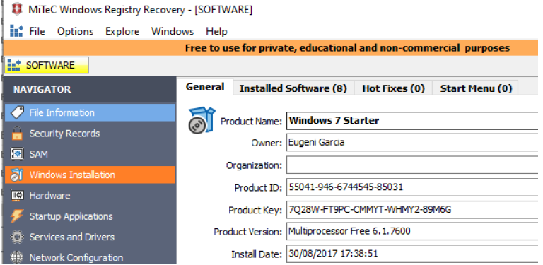
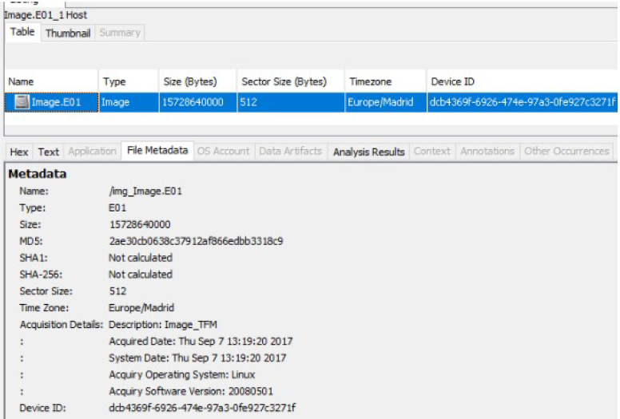
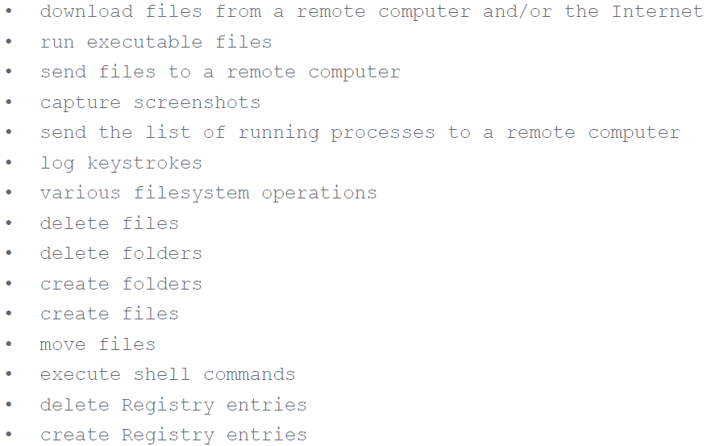

# Objective of the expertise  

Find evidence of an intrusion into the computer of the victim (Eugeni Garcia).  

# Reach  

The scope of this PEC is to test the knowledge acquired during the course in the Forensic Analysis subject. The idea is to be able to make / deliver an expert report as complete as possible. Since this is not a Final Degree Project, surely certain sections remain to be polished.  

# Background  

A university student requires the services of a forensic analyst because of an intrusion on his computer. He explains that important information has disappeared from his device.  
  
# Sources of information and starting point  

To carry out the forensic analysis related to this case, as an expert I have the following digital evidence:  

• Forensic image acquired from the alleged victim's computer.  

# Standards and norms  
  
There is no standard or regulation on how to carry out an expert report, but for carrying out this project I have taken into account:  

• The ISO/IEC 27037:2012 [3] good practice guide for handling digital evidence.  

Regarding the technical means, an HP PAvilion x360Convertible laptop with 16Gb of RAM was used. The following programs / websites have been used to carry out the expertise:  

• Autopsy 4.19  
• Windows Registry Recovery v3.1.0  
• Registry Explorer (v1.6.0.0)  
• SkypeLogView  
• John The Ripper  
• Event Viewer  
• virusradar.com  

# Limitations  

In the analysis of this project, I did not had any limitation at a legal level since I had the permissions of the owner of the computer to analyze all possible information, as well as emails electronics.  

# Expert report  

Due to the maximum space allowed, the annexes that should be made at the end of the expert report are not including some relevant information such a screenshot if necessary and specify the path of the file, the MAC time, logical size and the hash value. In this section should be added the analysis of
users, possible connected devices, recent files, files compressed/executable/eliminated, etc.  

# Identification of the OS and installed programs  

<b>Goal</b>  

Obtain information about the data contained in the hard disk, such as the OS, programs installed and other useful information that helps us know where to focus the forensic analysis digital.  

<b>Procedure</b>  

To find the OS of the image I extracted the SOFTWARE hive from Autopsy and loaded it into Windows Registry Recovery tool:  

  

# Findings  

According to a previous review of the image I have obtained the following information. It is a Windows7 Starter installed with date of 08/30/2017 at 17:38:51 hours and whose owner is registered with
the name of Eugeni Garcia. The product ID is 55041-946-6744545-85031. As it is a forensic image and not a running system, to obtain a list of the installed programs I can also extract this information from the hive previously mentioned.  
Clicking on the <i>Installed Software</i> label I see the following list:  

  

# Information about the physical disk drive of the obtained image  

<b>Goal</b>  

As it is a forensic image and without having much prior information on the physical hard drive, I proceeds to obtain as much information as possible.  
Using the Autopsy tool I wasable to see that it is a unit with a size of almost 16Gb.  

  

I found information about the identifier in Windows Registry Recovery by loading the hive from <b>SYSTEM</b> previously extracted with Autopsy:  

  

It is a hard drive model WDC WD3200BPVT/22jj5T0 ATA Device with a capacity of 320Gb.

# Findings  

It is a hard disk with a capacity of 320Gb of which only almost 16 GB. It is not possible for me to compare brand and model as this information has not been provided.  

# Trojan horse evidence  

<b>Goal</b>  

Analyze the file and find out if it is malicious software.  

Procedure:  

A password encrypted ZIP file is located in the downloaded file path. By forcing the encrypted file with a Password Recovery Tool (John the Ripper) I could access the content.  
The ZIP contains a malicious file, a backdoor-type Trojan, which must have allowed the attacker access to the system, infecting it and accessing it remotely.  

Among many things that the Trojan can do, the most relevant ones are detailed below:  

  

The attacker was able to delete or modify files, run programs, send emails massively or install more malicious tools. In this case, he proceeded to delete Final Project Degree of the victim.
