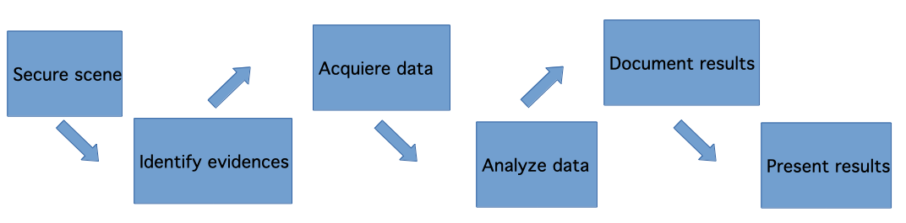
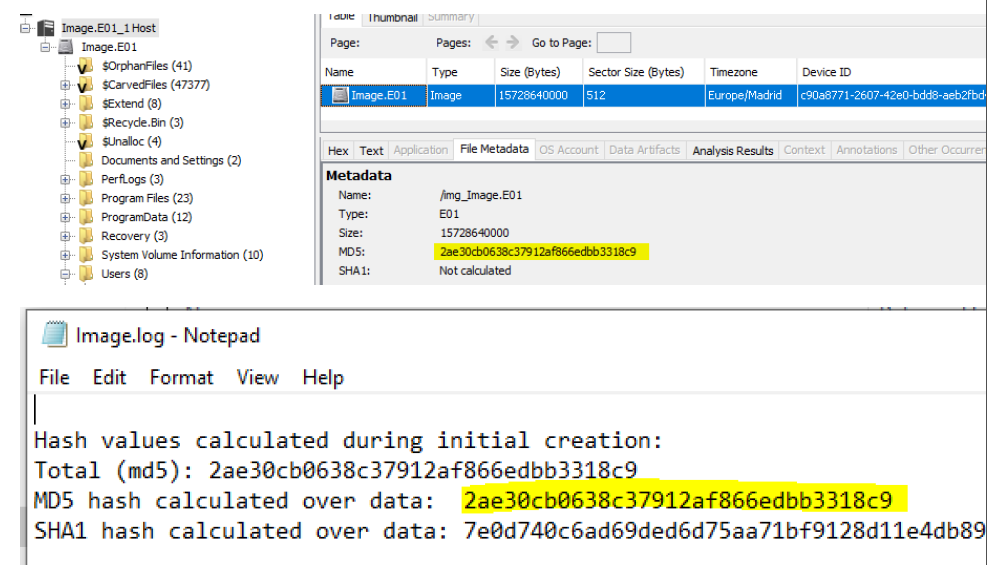
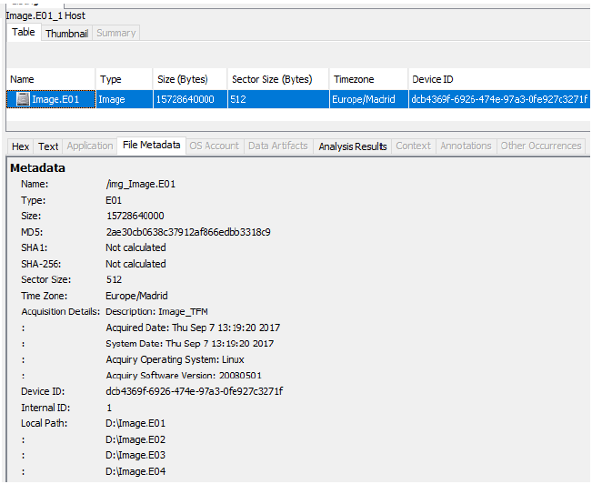
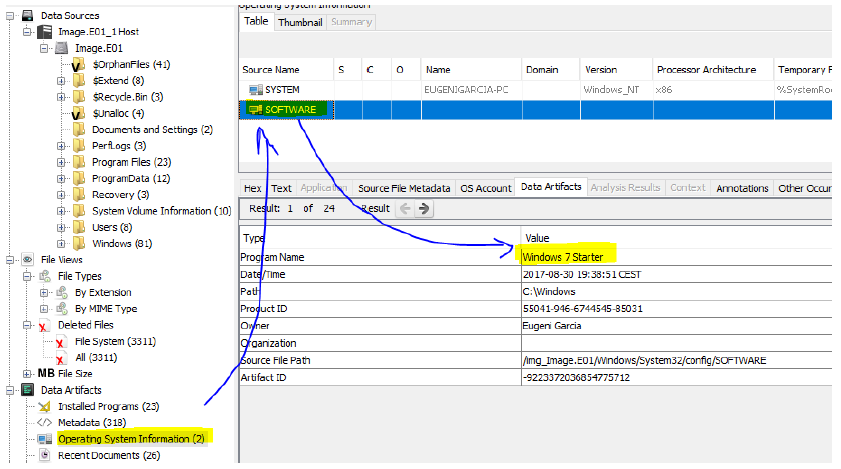
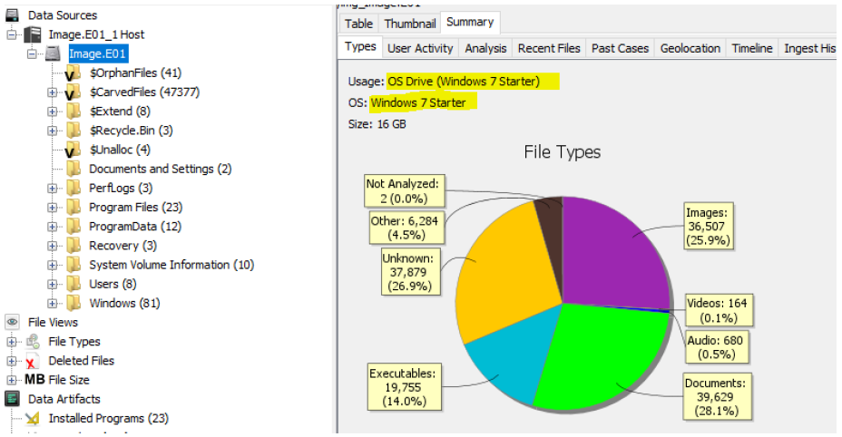
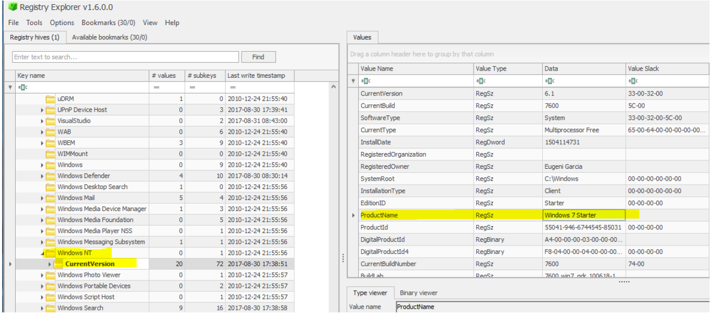
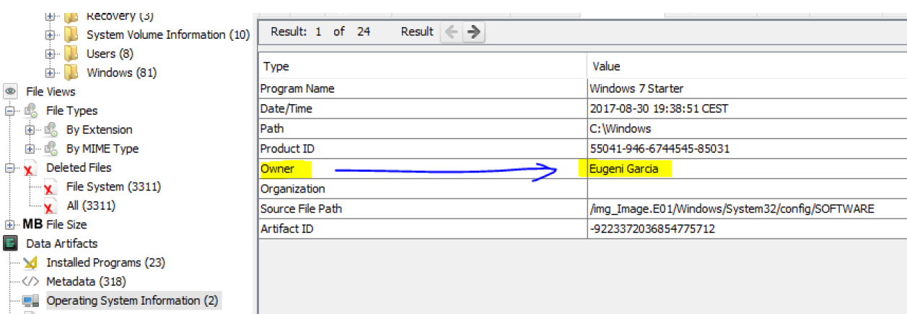
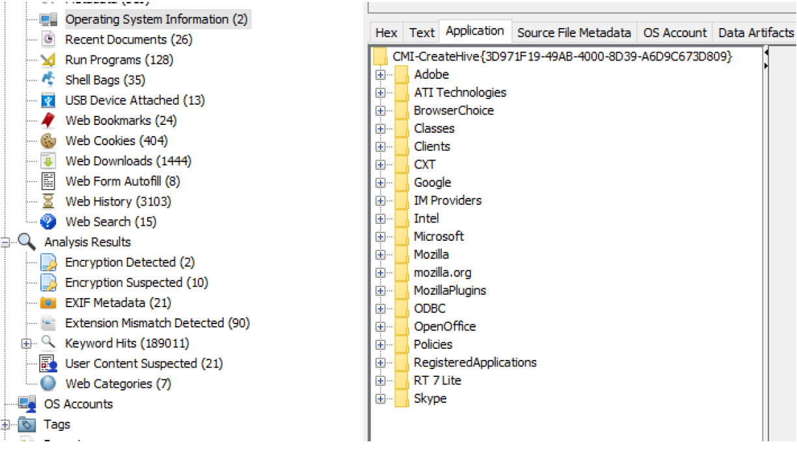
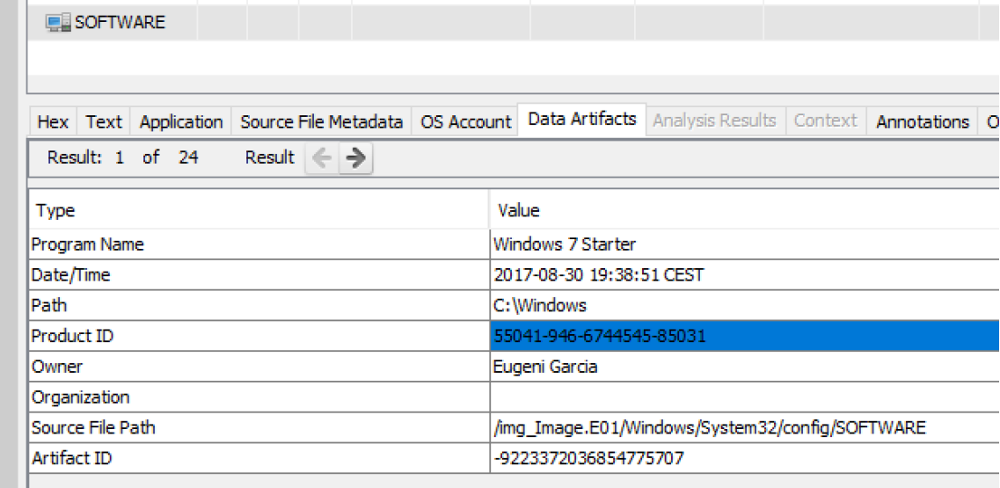
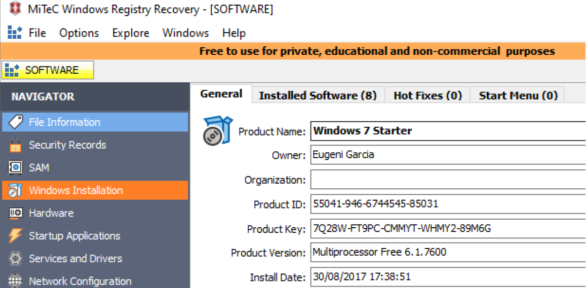

# Forensic Analysis

## Description
In this repository I will describe a real case senario on which I had to apply the knowledge acquired during the semester.
Some of the following descriptions were taking from the study modules I got for this subjetc and some other information was taken from the internet.

## Before explaining what F.A. is, let's talk about Forensic Science

Known as forensic science is what has as its object the application of scientific practices within the legal process. Forensic science is usually referred to just with term <i>forensics</i>. The
Forensic Science encompasses both the civil and criminal branches of law.  
In fact, is has expanded so much that there are currently many branches of science that provide support in problem solving, such as:  

• Accounting forensics: Acquisition, interpretation and study of accounting.  
• Computer forensics: Recovery, reconstruction and interpretation of digital media that is stored on a computer, for use as a test.  
• Forensic economics: Acquisition, study and interpretation of evidence related to economic damage. Includes determination of loss of profits and gains, the value of the business and the loss of profits, etc.  
• Forensic engineering: Reconstruction, study and interpretation of a failure mechanical or structural (of buildings, bridges, etc.).  
• Forensic linguistics: Study and interpretation of the language for its use as legal evidence.  
• Forensic psychology and psychiatry: Study, evaluation and identification of diseases related to human behavior and his mind to obtain legal evidence.  
• Forensic dentistry: Study of teeth, specifically uniqueness of the dentition.  
• Pathology forensics: Combines the disciplines of medicine and pathology to determine the causes of injury or death.  
• Forensic toxicolog:. Study, evaluation and identification of the effects of poisons, chemicals or drugs in the human body.

## What is Forensic Analytics?  

Forensic analytics is a field that combines data analysis, investigative techniques, and financial expertise to detect, prevent, and investigate fraudulent activities or irregularities within organizations or financial systems. It involves using various analytical methods and tools to examine financial data, transaction records, and other relevant information to uncover patterns, anomalies, and potential signs of misconduct or fraud.  
For a more accurated description, we could say that <i>Computer Forensic Analysis is called the process resulting from applying scientific methods to computer systems in order to secure, identify, preserve, analyze and present digital evidence, so that it is accepted in a judicial process</i>.

## How does Forensic Analysis works?  

Forensic analysis involves a systematic process of examining data, transactions and records to uncover evidence of fraud, misconduct, or irregularities. The process typically includes the following steps:  


## Why is it important?  

Forensic analysis is often used for providing evidence in court hearings, especially in criminal investigations. It employs wide range of investigative procedures and technologies.

## Scenario  

A university student requires your services as a forensic analyst as a result of a computer intrusion during which, as he explains, important information has disappeared from his computer.
The student affirms that there was contact with the author of the intrusion. This contact occurred on two different dates:  
▪ The first time, the student received, while his computer was running, a message explaining that his computer had been hacked. Next, the student observed that his computer performed unexpected actions and how, among other things, his research paper disappeared from the hard drive. He then received a message requesting a certain amount of money to recover the lost information and asking him to specify the payment method at a later date through a chat. The student decided to ask for help from a friend of his from a computer profession.  
▪ On the second day, the aforementioned chat took place, during which the perpetrator specified the method of payment. A computer science friend of the student, was also present. After the chat, once the situation has been assessed, said computer science decides to disconnect the computer from the network and acquire a forensic image of the computer's hard drive. Finally, the student decides not to make the payment and hires your services so that you find out, if possible, what has happened and locate all the information that could lead to the identification of the presumed author of the intrusion.  
You must carry out a complete analysis of the forensic image (question 1 of the statement) and write an executive report (question 2 of the statement).  

## Tools and web pages used during the analysis  

- [Autopsy - Forensic tool](https://www.autopsy.com/)
- [John the ripper - Password cracker](https://www.openwall.com/john/)
- [Windows Registry Recovery](https://www.mitec.cz/wrr.html)
- [Registry Explorer (v1.6.0.0)](https://ericzimmerman.github.io/#!index.md)
- [SkypeLogView](https://www.nirsoft.net/utils/skype_log_view.html)
- [Event Viewer - Windows application](https://www.howtogeek.com/123646/htg-explains-what-the-windows-event-viewer-is-and-how-you-can-use-it/)
- [virusradar.com](https://www.virusradar.com/)

## These were the questions I had to answer on this practical delivery  

<b>1. Forensic analysis of a computer system.  
1.1. Check the integrity of the forensic image that you must analyze.</b>  

We check the integrity of the system by comparing the Hash we get when loading the image in Autopsy with the Hash that they have previously provided us.  

  

We see that the integrity of the evidence has been maintained since the MD5 HASH values
match.  

<b>1.2. By studying the forensic image, determine the following information, related to the operating system installed on the computer you are analyzing:</b> 

<b>a) How big is the partition to scan?</b>  

The partition has a size of 15728640000 bytes (about 16 Gigabytes).  

  

<b>b) System and version of the operating system installed.</b>  

The installed System is a Microsoft Windows.  
The OS version: Windows 7 Starter.  
Path: Windows/System32/config/SOFTWARE  
Content:  

  

MAC time:  
Modified:2017-09-07 10:41:35 CEST  
Accessed:2017-09-07 10:41:35 CEST  
Created:2009-07-14 04:03:40 CEST  
Changed:2017-09-07 10:41:34 CEST  

Logical size: 23330816  
Hash value: 9869804384dc41382ad0805a8e597ded  
You can also see this information in the image summary:  

  
  
Autopsy logs can also be extracted and opened in Registry Explorer.  
Making a review of the extracted file or hive (SOFTWARE):  

 

<b>c) Name of the owner and list of installed software.</b>  

The owner we get from the analysis done in Autopsy is: Eugeni Garcia. 

 

List of installed software:

 

<b>d)"Product ID" and "Product Key" associated with the system</b>  

To obtain the Product Key I have loaded the SOFTWARE hive in the tool <i>Windows Registry Recovery</i> (v3.1.0).  
Product ID content:  

  

Product Key content:  

  

Path: `Windows/System32/config/SOFTWARE`

MAC time:
```
Modified:2017-09-07 10:41:35 CEST
Accessed: 2017-09-07 10:41:35 CEST
Created:2009-07-14 04:03:40 CEST
Changed:2017-09-07 10:41:34 CEST
```
Logical size: `23330816`
Hash value: `9869804384dc41382ad0805a8e597ded`

<b>e) Date and time of installation of the operating system</b>

The operating system was installed on `2017-08-30 19:38:51 CEST`.


Path: `Windows/System32/config/SOFTWARE`

MAC time:
```
Modified:2017-09-07 10:41:35 CEST
Accessed:2017-09-07 10:41:35 CEST
Created:2009-07-14 04:03:40 CEST
Changed:2017-09-07 10:41:34 CEST
```
Logical size: `23330816`
Hash value: `9869804384dc41382ad0805a8e597ded`


Determine brand and model (if possible) of the following hardware: CPU, monitor, graphics card, Ethernet and Wireless card (0.5 points)
1.3. It determines which users the system has defined (without taking into account the users defined by default) and locates the date and time of the last logon of each located user (0.5 points).
1.4. Perform the following actions, answer the questions and locate the relevant evidence, associating it, if possible, with the user to which it belongs (only those related to the criminal act stated in the statement):
to. Locate the documents (PDF files, text files, spreadsheets, etc.) that may be related to any allegedly criminal conduct (0.5 points).
b. Locates the deleted files and determines if any are relevant to the investigated cause (0.5 points).
c. Locate the relevant compressed files. Have you located any password protected files? Have you been able to access its content? (checks that there is no malicious program) (1 point).

>[!NOTE]
><b> WILL BE COMPLETED SOON <b>

<!--
## What now?

The idea is to improve this script to make it a bit more sofisticated something like sending out an email when a file integrity violation is detected.
-->
