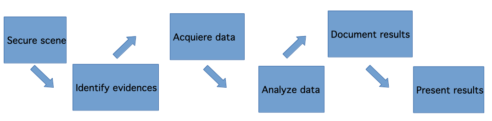

# Forensic Analytics

## Description:
In this repository I will describe a real case senario on which I had to apply the knowledge acquired during the semester.
Some of the following descriptions were taking from the study modules I got for this subjetc and some other information was taken from the internet.

## Before explaining what F.A., let's talk about Forensic Science:

Known as forensic science is what has as its object the application of scientific practices within the legal process. Forensic science is usually referred to just with term <i>forensics</i>. The
Forensic Science encompasses both the civil and criminal branches of law.  
In fact, is has expanded so much that there are currently many branches of science that provide support in problem solving, such as:  

• Accounting forensics: Acquisition, interpretation and study of accounting.  
• Computer forensics: Recovery, reconstruction and interpretation of digital media that is stored on a computer, for use as a test.  
• Forensic economics: Acquisition, study and interpretation of evidence related to economic damage. Includes determination of loss of profits and gains, the value of the business and the loss of profits, etc.  
• Forensic engineering: Reconstruction, study and interpretation of a failure mechanical or structural (of buildings, bridges, etc.).  
• Forensic linguistics: Study and interpretation of the language for its use as legal evidence.  
• Forensic psychology and psychiatry: Study, evaluation and identification of diseases related to human behavior and his mind to obtain legal evidence.  
• Forensic dentistry: Study of teeth, specifically uniqueness of the dentition.  
• Pathology forensics: Combines the disciplines of medicine and pathology to determine the causes of injury or death.  
• Forensic toxicolog:. Study, evaluation and identification of the effects of poisons, chemicals or drugs in the human body.

## What is Forensic Analytics?  

Forensic analytics is a field that combines data analysis, investigative techniques, and financial expertise to detect, prevent, and investigate fraudulent activities or irregularities within organizations or financial systems. It involves using various analytical methods and tools to examine financial data, transaction records, and other relevant information to uncover patterns, anomalies, and potential signs of misconduct or fraud.  
For a more accurated description, we could say that <i>Computer Forensic Analysis is called the process resulting from applying scientific methods to computer systems in order to secure, identify, preserve, analyze and present digital evidence, so that it is accepted in a judicial process</i>.

## How does Forensic Analysis works?  

Forensic analysis involves a systematic process of examining data, transactions, and records to uncover evidence of fraud, misconduct, or irregularities. The process typically includes the following steps:  

## Why is it important?  

Forensic analysis is often used for providing evidence in court hearings, especially in criminal investigations. It employs wide range of investigative procedures and technologies.

## Scneraio  

A university student requires your services as a forensic analyst as a result of a computer intrusion during which, as he explains, important information has disappeared from his computer.
The student affirms that there was contact with the author of the intrusion. This contact occurred on two different dates:  
▪ The first time, the student received, while his computer was running, a message explaining that his computer had been hacked. Next, the student observed that his computer performed unexpected actions and how, among other things, his research paper disappeared from the hard drive. He then received a message requesting a certain amount of money to recover the lost information and asking him to specify the payment method at a later date through a chat. The student decided to ask for help from a friend of his from a computer profession.  
▪ On the second day, the aforementioned chat took place, during which the perpetrator specified the method of payment. A computer science friend of the student, was also present. After the chat, once the situation has been assessed, said computer science decides to disconnect the computer from the network and acquire a forensic image of the computer's hard drive. Finally, the student decides not to make the payment and hires your services so that you find out, if possible, what has happened and locate all the information that could lead to the identification of the presumed author of the intrusion.  
You must carry out a complete analysis of the forensic image (question 1 of the statement) and write an executive report (question 2 of the statement).

## What tools were used during the analysis

## What now?

The idea is to improve this script to make it a bit more sofisticated something like sending out an email when a file integrity violation is detected.
